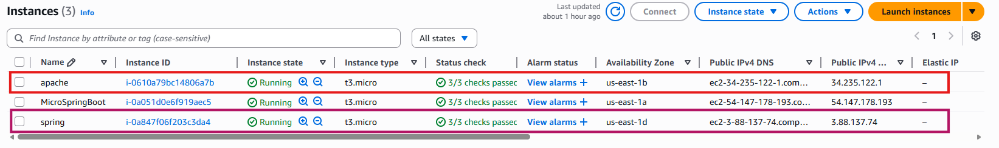
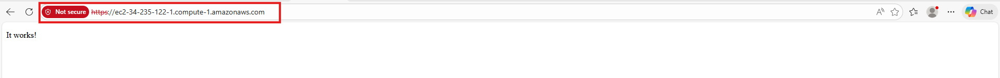
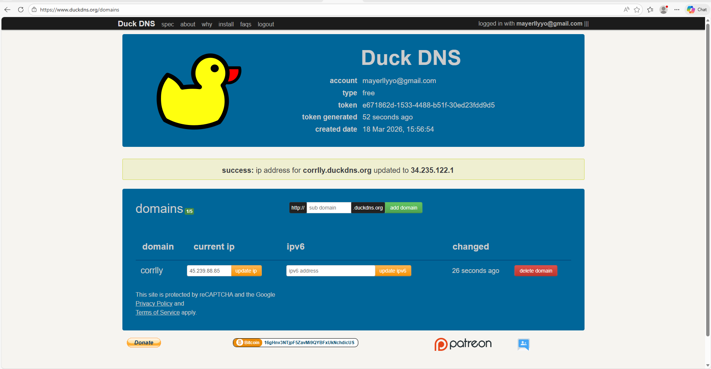
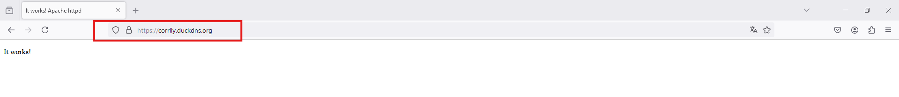
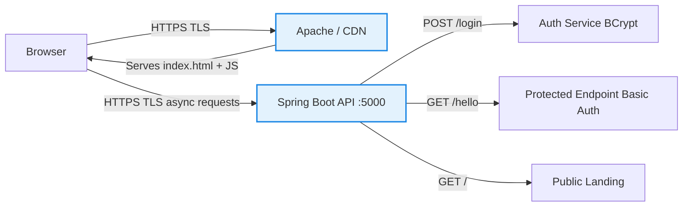
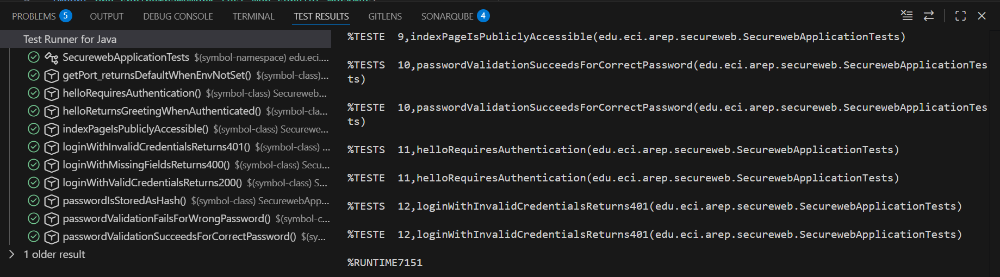
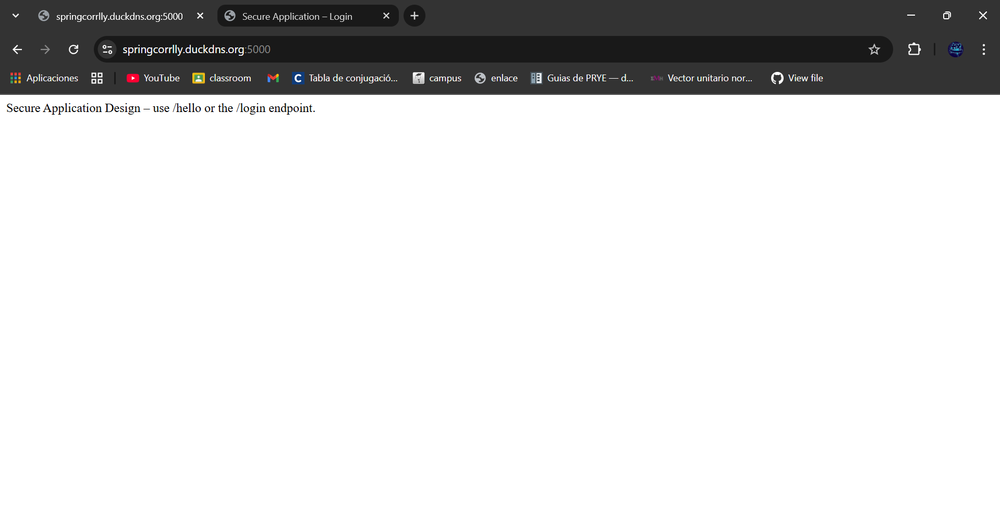
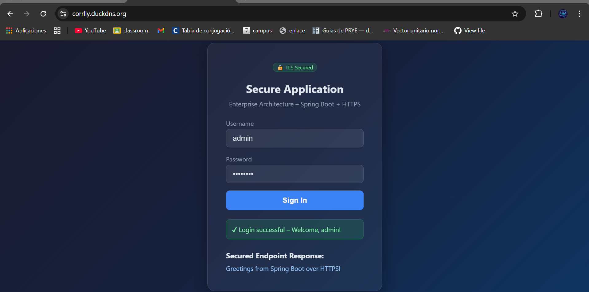

# Secure Application Design – Spring Boot + TLS

This project demonstrates a secure and scalable application deployed on AWS using Apache and Spring. The Apache server delivers an asynchronous HTML and JavaScript client over TLS, ensuring secure data transmission. The Spring backend provides RESTful APIs, also protected with TLS.

Security features include TLS encryption with Let’s Encrypt certificates and login authentication with hashed passwords. The architecture follows best practices for multi-server deployment and secure communication, showcasing how to protect user data while maintaining performance and scalability in cloud-based applications.

## Getting Started

These instructions will help you set up and run the secure application on your local machine for development and testing.

### Prerequisites

To run this project, you need the following software installed:

- Java 17+
- Maven 3.8+
- A modern web browser (Chrome, Firefox, Safari, Edge)

### Class Work Evidence (AWS Deployment)

During the workshop, the following steps were completed:

1. Launching EC2 Instances

   Two EC2 instances were created:
      * Instance 1 (Apache) → Serves the client
      * Instance 2 (Spring Boot) → Backend API

   

2. Apache Running over HTTP (Initial Test)

   The Apache server was successfully deployed and tested using HTTP:

   

3. Domain Configuration with DuckDNS

   A custom domain was configured using DuckDNS:

   
   * Domain: corrlly.duckdns.org
   * Successfully mapped to EC2 public IP
   * Dynamic DNS configured correctly

4. HTTPS with TLS (Secure Connection)

   TLS was configured using Let's Encrypt, enabling HTTPS:

   
   * Secure connection established
   * Browser shows (HTTPS enabled)
   * Data is encrypted using TLS
### Installing

Follow these steps to set up your development environment:

**Step 1: Clone the repository**

```bash
git clone https://github.com/mayerllyyo/Secure-Application-Design-Spring-Boot-TLS
cd Secure-Application-Design-Spring-Boot-TLS
```

**Step 2: Configure environment variables**

```bash
export PORT=5000
export KEYSTORE_PATH=classpath:keystore/ecikeystore.p12
export KEYSTORE_PASSWORD=changeit
export KEYSTORE_ALIAS=ecikeypair
export TRUSTSTORE_PATH=keystores/myTrustStore
export TRUSTSTORE_PASSWORD=567890
```

**Step 3: Build and run**

```bash
mvn clean package -DskipTests
java -jar target/Secureweb-0.0.1-SNAPSHOT.jar
```

Open `https://localhost:5000/` in your browser (accept the self-signed certificate warning).

## Built With

* [Spring Boot 3](https://spring.io/projects/spring-boot) - Java web framework
* [Spring Security](https://spring.io/projects/spring-security) - Authentication and authorization
* [Spring MVC](https://spring.io/projects/spring-framework) - Servlet-based web application framework
* [BCrypt](https://en.wikipedia.org/wiki/Bcrypt) - Password hashing algorithm
* [Apache](https://httpd.apache.org/) - Reverse proxy and static content server
* [HTML5 + Vanilla JavaScript](https://developer.mozilla.org/en-US/docs/Web/JavaScript) - Async client with Fetch API

## Problem Description

This project addresses the challenges of building secure web applications in a cloud environment. Key objectives include:

1. **Secure Communication**: Implement TLS/HTTPS for all client-server interactions
2. **Authentication & Authorization**: Secure login with hashed password storage
3. **Multi-Server Architecture**: Separate concerns between web server and API server
4. **Environment-Driven Configuration**: Follow 12-factor app principles for secrets management
5. **Server-to-Server Security**: Enable mutual TLS trust between backend services

### Key Challenges

- Preventing unauthorized access to sensitive endpoints
- Ensuring encrypted communication across all layers
- Managing cryptographic keys securely without hard-coding secrets
- Implementing scalable authentication for multi-server deployments


## Architecture Overview

#### System Architecture



#### Key Components

| Layer | Technology | Purpose |
|---|---|---|
| HTTP Client | HTML5 + Vanilla JS (async/await) | Async UI served over TLS |
| REST API | Spring Boot 3 + Spring MVC | RESTful endpoints |
| Authentication | Spring Security + BCrypt | Login with hashed passwords |
| TLS | PKCS12 KeyStore | Encrypt all traffic |
| Config | Environment variables | 12-factor app principle III |


## Security Features

### TLS / HTTPS
All communication uses TLS. The server loads a PKCS12 KeyStore whose path and password are read from **environment variables** (never hard-coded):

```properties
server.ssl.key-store=${KEYSTORE_PATH:classpath:keystore/ecikeystore.p12}
server.ssl.key-store-password=${KEYSTORE_PASSWORD:changeit}
server.ssl.key-alias=${KEYSTORE_ALIAS:ecikeypair}
server.ssl.enabled=true
```

### Password Hashing
Passwords are **never stored in plain text**. `BCryptPasswordEncoder` is used throughout:
```java
String hashed = passwordEncoder.encode(rawPassword);  // stored
passwordEncoder.matches(rawPassword, hashed);          // verified
```

### SecureUrlReader (Server-to-Server TLS)
`SecureUrlReader` demonstrates server-to-server HTTPS using a custom TrustStore, enabling mutual TLS trust between back-end servers:
```java
SecureUrlReader.initializeTrustStore();           // loads TrustStore from env
String body = SecureUrlReader.readUrl("https://other-server:5000/hello");
```

### KeyStore & TrustStore Management

The KeyStore (`src/main/resources/keystore/ecikeystore.p12`) is pre-included in the project.

For server-to-server TLS communication, create a TrustStore file at `keystores/myTrustStore` or specify the path via the `TRUSTSTORE_PATH` environment variable.

> **Never commit real passwords or keystores to source control.**  
> Use AWS Secrets Manager, Parameter Store, or similar services in production.

### Demo Credentials

| Username | Password   |
|----------|------------|
| admin    | admin123   |
| user     | password   |


## REST API

### `POST /login`
Authenticate a user.

**Request**
```json
{ "username": "admin", "password": "admin123" }
```

**Response – 200 OK**
```json
{ "message": "Login successful", "user": "admin" }
```

**Response – 401 Unauthorized**
```json
{ "error": "Invalid credentials" }
```


### `GET /hello`
Requires HTTP Basic Authentication.

**Response – 200 OK**
```
Greetings from Spring Boot over HTTPS!
```

## Running Tests

```bash
mvn test
```

Tests use an in-memory context with TLS disabled (port `0` is assigned dynamically), so no keystore file is needed for CI.

## AWS Deployment

1. Launch **two EC2 instances** (Amazon Linux 2023):
   - **Server 1** – Apache, serves `index.html` over HTTPS (Let's Encrypt)
   - **Server 2** – Spring Boot, serves REST API over HTTPS

2. Install dependencies on **Server 2** (Spring Boot):
   ```bash
   sudo dnf update -y
   sudo dnf install -y java-17-amazon-corretto maven git
   ```

3. Create the VirtualHost config on **Server 1** (Apache) so Certbot can recognize the domain:
   ```bash
   sudo nano /etc/httpd/conf.d/<yourdomain>.conf
   ```
   ```apache
   <VirtualHost *:80>
       ServerName <yourdomain>

       DocumentRoot /var/www/html

       <Directory /var/www/html>
           AllowOverride All
           Require all granted
       </Directory>

       ErrorLog /var/log/httpd/<yourdomain>_error.log
       CustomLog /var/log/httpd/<yourdomain>_access.log combined
   </VirtualHost>
   ```
   ```bash
   sudo systemctl restart httpd
   ```

4. Install Let's Encrypt certificates on **both servers**:

   ```bash
   sudo dnf install certbot python3-certbot-apache -y
   sudo certbot --apache
   ```

5. Convert the Let's Encrypt certificate to PKCS12 format for Spring Boot (**Server 2**):
   ```bash
   sudo openssl pkcs12 -export \
     -in    /etc/letsencrypt/live/<yourdomain-spring>/fullchain.pem \
     -inkey /etc/letsencrypt/live/<yourdomain-spring>/privkey.pem \
     -out   /home/ec2-user/keystore.p12 \
     -name  ecikeypair \
     -password pass:changeit

   sudo chmod 644 /home/ec2-user/keystore.p12
   ```

6. Clone, build and run the Spring Boot application (**Server 2**):
   ```bash
   git clone https://github.com/<user>/<repo>.git
   cd <repo>
   mvn clean package -DskipTests

   nohup java \
   -DKEYSTORE_PATH=/home/ec2-user/keystore.p12 \
   -DKEYSTORE_PASSWORD=changeit \
   -DKEYSTORE_ALIAS=ecikeypair \
   -jar target/<app>.jar > /home/ec2-user/app.log 2>&1 &
   ```
   

   > **Note:** Configure CORS in `SecurityConfig.java` to allow requests from the Apache frontend domain:
   > ```java
   > config.setAllowedOrigins(List.of("https://<yourdomain-apache>"));
   > ```

7. Place `index.html` on **Server 1** and update the fetch URLs to point to the Spring Boot server:
   ```bash
   sudo nano /var/www/html/index.html
   ```
   ```javascript
   const response = await fetch('https://<yourdomain-spring>:<port>/login', { ... })
   const resp     = await fetch('https://<yourdomain-spring>:<port>/hello', { ... })
   ```
   

## Author

- **Mayerlly Suárez Correa** [mayerllyyo](https://github.com/mayerllyyo)

## License

This project is licensed under the MIT License - see the [LICENSE](LICENSE) file for details